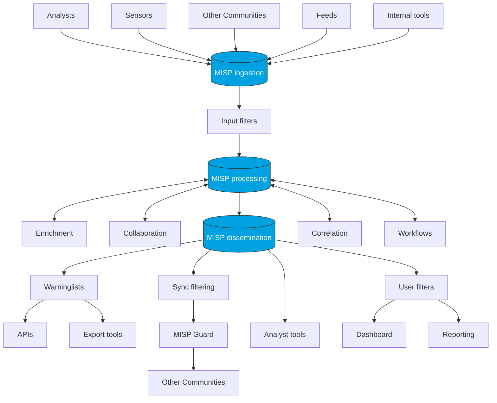

```mermaid
flowchart
    A[Analysts] --> MI[(MISP ingestion)]
    S[Sensors] --> MI
    OM[Other Communities] --> MI
    F[Feeds] --> MI
    IT[Internal tools] --> MI
    MI --> IF[Input filters]
    IF --> MP[(MISP processing)]
    MP <--> E[Enrichment]
    MP <--> Col[Collaboration]
    MP --> MD[(MISP dissemination)]
    MP <--> C[Correlation]
    MP <--> Wo[Workflows]
    MD --> W[Warninglists]
    W --> APIs
    W --> Ex[Export tools]
    MD --> SF[Sync filtering]
    SF --> MG[MISP Guard]
    MG --> OM2[Other Communities] 
    MD ---> Analyst[Analyst tools]
    MD --> UF[User filters]
    UF --> Dashboard
    UF --> Reporting
    
    
    
    style MI fill:#00a1e0,stroke:#333,stroke-width:1px,color:#fff
    style MP fill:#00a1e0,stroke:#333,stroke-width:1px,color:#fff
    style MD fill:#00a1e0,stroke:#333,stroke-width:1px,color:#fff
```
