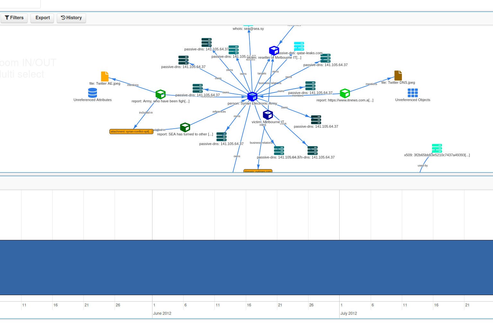

# MISP events used as example for MISP trainings and workshop

MISP events in JSON format which can be used in MISP trainings, workshop and exercises.

## Sample events with real cases

- [ATM Vulnerabilities Allow Deposit Forgery Attacks - Galaxy for finance, eventreport](./atm-vulnerabilities-allow-deposit-forgery-attacks.json).
- [Kobalos - Linux threat to high performance computing infrastructure - EventReport, EventGraph](./kobalos-linux-threat-to-hpc.json).
- [Investigation Syrian Electronic Army Activities - graph, timeline usage](./syrian-electronic-army-domain-take-over.json).
- [Targeted phishing - PDF documents / phishkit - YARA tracking - graph, tracking via YARA rules](./targeted-phishing-pdf-phishkit-yara.json).

## Sample events with synthetic data

- [Decaying example](./sample-decaying-example.json). Synthetic data to show the decaying functionality in MISP.
- [Sample spear phishing](./sample-spear-phishing-attempt-targeting-telco.json) created from [exercise](./sample-spear-phishing-attempt-targeting-telco.text).

